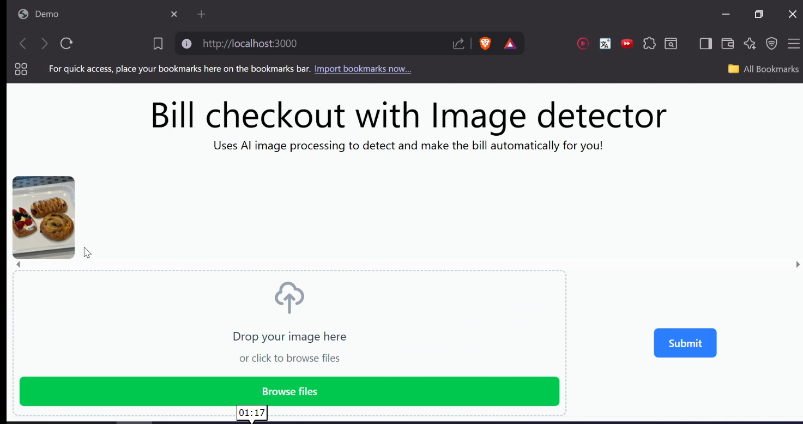
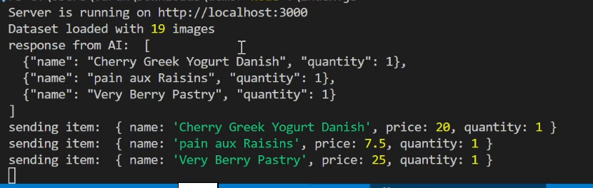
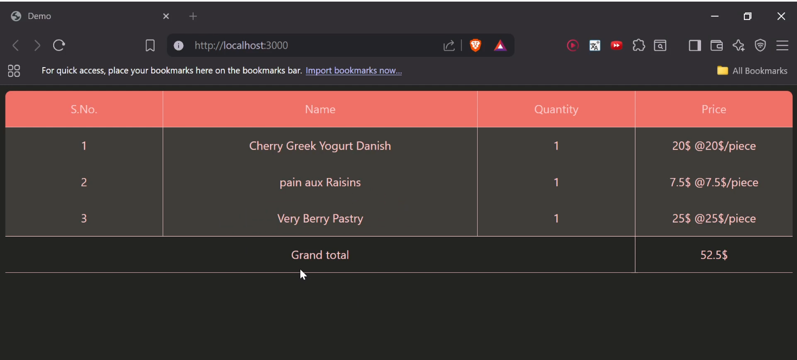

# How it works

menu.json inside public/menu -

contains list of items along with their names, price and relative path to reference images for the LLM.
The reference images should only be either jpg, jpeg or png.

After that you provide image(s) from the web ui :



AI uses the reference images to figure out item name :  


Reflected on web ui :


# Setup

After cloning, Start by running :

```bash
npm install
npm run dev
```

This will start the web server at `http://localhost:3000`

# Prompt

I used gemini 2.5 pro for this as its free and its context windows are huge and generous but a better model can be used if you have access to it.

initial prompt for the LLM :

```javascript
const prompt = `
You are given some image of food products and names of those products in the next message to each of the images. 

You will also receive a **new image**. This new image may show one or more units of a product from the dataset, or something completely different.

### Your Task:

1. Compare the new image to the dataset images.
2. Identify **which product** from the dataset appears in the image, based on visual similarity.
3. Count **how many units** of that product are present in the image.
4. If the new image **does not** match any product in the dataset (visually too different), or
you see even slight Variance, for example : a cookie in the image looking a little large or different design than the one provided in the dataset, give [], Guessing randomly is worse than guessing nothing

IF you dont find a match, return:

[]

5. Otherwise, return only the **closest matching product** in the following JSON format:

[
    {"name<>":"<name of the product matched from the dataset", "quantity": "<number of items detected>"},
    {"name":"<name of the product matched from the dataset", "quantity": "<number of items detected>"},
    {"name":"<name of the product matched from the dataset", "quantity": "<number of items detected>"},
    ...
]


Do not output anything else — only this JSON. Output raw JSON. Do NOT use any triple backticks or code blocks. The response must be plain text only.

Examples of a valid return : 

1. [{ "name" : "croissant" , "quantity" : 6},{ "name" : "Cheese Quiche", "quantity" : 1 }, {"name" : "Triple Chip Chocolate cookie", "quantity" : 1}]
2. [{ "name" : "Pastry frank", "quantity" : 2}]
3. []

Examples of invalid returns:  

1. [{"name" : 2, quantity: "2" }] (the quantity 2 must be a number and name must be a string)

`;
```
